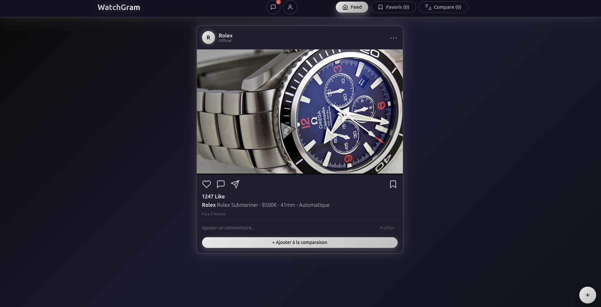
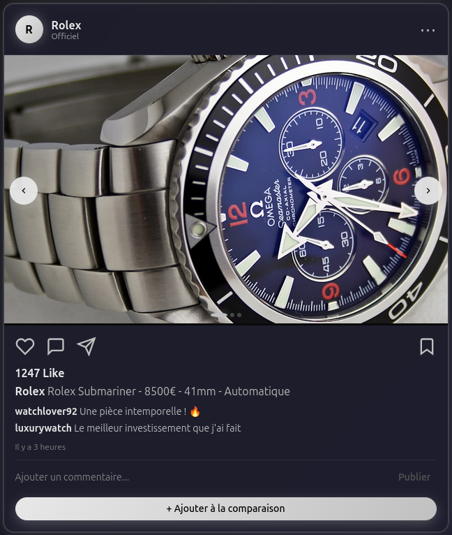

    # 👉 Ctrl + Shift + V

Functional assumptions per page:
Feed Page:

Displays a chronological or algorithmic feed of posts

Each post contains:

Brand and model

Key information (model, price, size, movement type)

Interactions: like, comment, add to favorites

"Add to comparison" button

Quick navigation to:

Brand/user profile

Detailed product page

Main purpose: discovering watches

